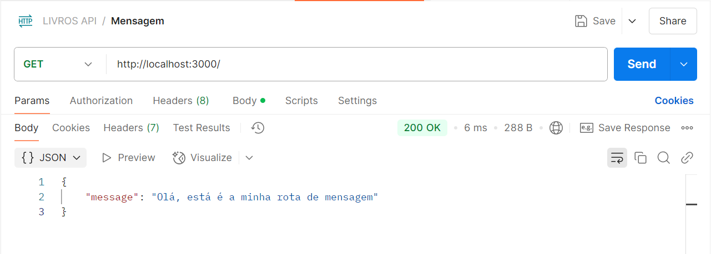
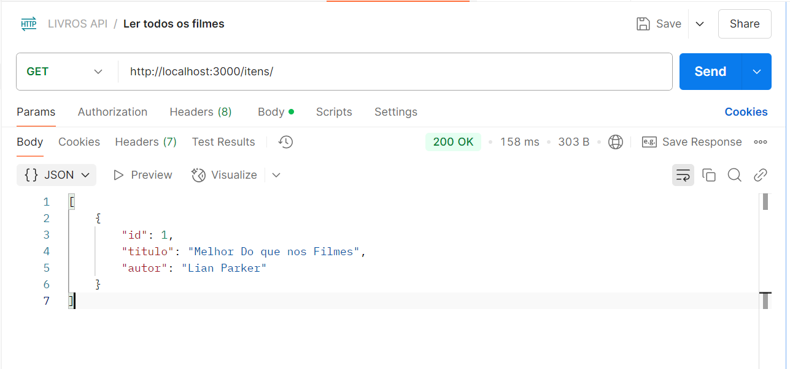
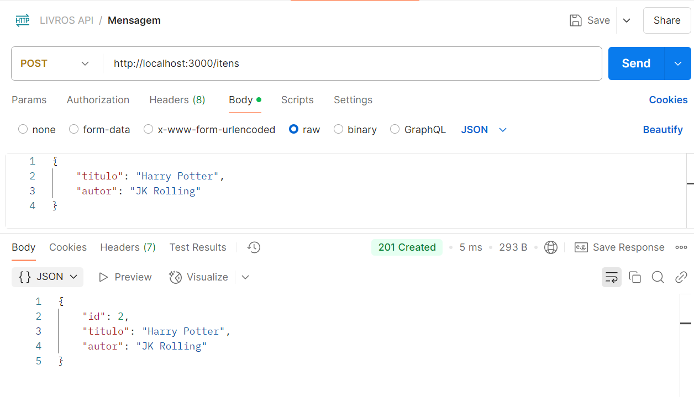
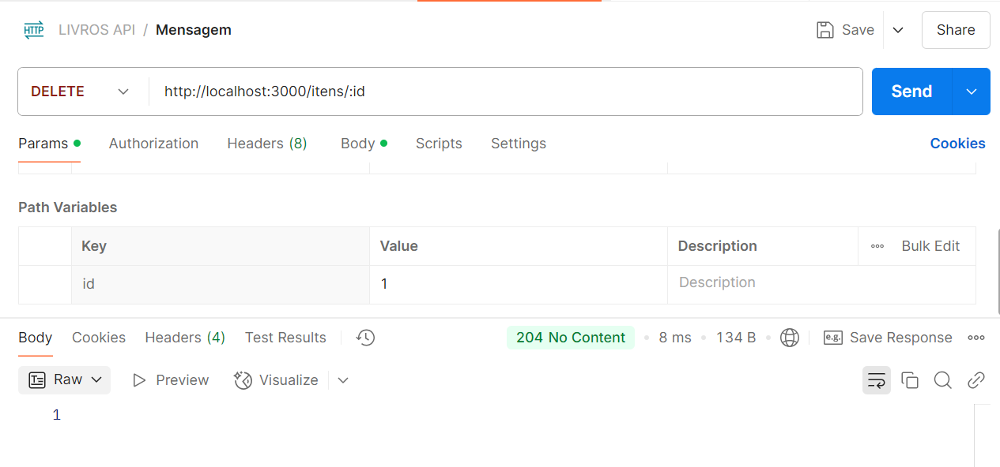

# 📚 API de Livros - MVC com Node.js e Express

## 📖 Sobre o Projeto
Esta API foi desenvolvida utilizando **Node.js** e **Express**, seguindo a arquitetura **MVC** (Model-View-Controller). O objetivo do projeto é fornecer um sistema de gerenciamento de livros, permitindo operações de **CRD** (Create, Read, Delete) de maneira eficiente e organizada.

## 👥 Equipe de Desenvolvimento
<table>
    <tr>
        <td align="center" width="20%">
                
                <br /><b>Sophia Balico</b>
            <br />
        </td>
        <td align="center" width="20%">
                
                <br /><b>Mariana Cardoso</b>
            <br />
            <sub></sub>
        </td>
    </tr>
    <tr>
        <td align="center" width="20%">
                
                <br /><b>Maria Eduarda Reis</b>
            <br />
        </td>
        <td align="center" width="20%">
                
                <br /><b>Anna Clara</b>
            <br />
            <sub></sub>
        </td>
    </tr>
</table>

## 🚀 Tecnologias Utilizadas

- **Node.js** - Ambiente de execução para JavaScript no servidor
- **Express.js** - Framework web para Node.js
- **Nodemon** - Monitoramento do código em tempo real
- **Dotenv** - Gerenciamento de variáveis de ambiente

## 📂 Estrutura do Projeto

```
📦 api-livros
 ┣ 📂 controllers  # Lógica das requisições
 ┣ 📂 models       # Modelos de dados
 ┣ 📂 routes       # Rotas da aplicação
 ┣ 📜 .env           # Variáveis de ambiente
 ┣ 📜 package.json   # Dependências e scripts
 ┣ 📜 server.js      # Ponto de entrada da aplicação
```
## Testes no Postman
[](https://www.postman.com/)

### Metodos
- **📃GET**: http://localhost:3000/



- **📃GET**: http://localhost:3000/items



- **✅POST**: http://localhost:3000/items



- **❌DELETE**: http://localhost:3000/items/:id



## 📌 Endpoints Disponíveis

### 🔍 Livros
| Método | Endpoint       | Descrição |
|--------|--------------|-----------|
| GET    | `/items`    | Lista todos os Livros |
| GET    | `/items/:id` | Obtém detalhes de um livro |
| POST   | `/items`    | Adiciona um novo livro |existente |
| DELETE | `/items/:id` | Remove um livro |

## 🛠 Como Executar o Projeto

### 🔧 Pré-requisitos
Antes de começar, você precisará ter a seguinte ferramenta instalada em sua máquina:
- [Node.js](https://nodejs.org/)

### ▶ Passos para executar

1. Clone este repositório:
```sh
 git clone https://github.com/seu-usuario/api-livros.git
```

2. Acesse a pasta do projeto:
```sh
 cd api-livros
```

3. Instale as dependências:
```sh
 npm install nodemon express dotenv
```

4. Configure as variáveis de ambiente:
Crie um arquivo `.env` na raiz do projeto e adicione a seguinte variável:
```env
PORT=3000
```

5. Execute o servidor:
```sh
 npm run dev
```

O servidor estará rodando em `http://localhost:3000`


## 🎯 Contribuindo
Sinta-se à vontade para contribuir com melhorias para este projeto! Para isso:

1. Faça um fork do repositório
2. Crie uma branch com sua feature (`git checkout -b minha-feature`)
3. Faça commit das suas alterações (`git commit -m 'Adiciona nova feature'`)
4. Envie para o repositório (`git push origin minha-feature`)
5. Abra um Pull Request

## 📜 Licença
Este projeto está licenciado sob a **MIT License** – sinta-se livre para utilizá-lo e modificá-lo conforme necessário!


